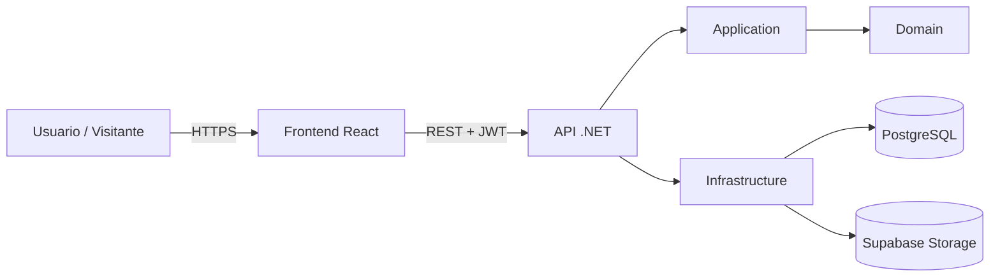

# Liga Club12

Sistema web de gestión integral para torneos de fútbol/básquet: equipos, jugadores, partidos, estadísticas, sanciones y usuarios, con un panel administrativo privado y una vista pública para los visitantes de la liga.

Proyecto desarrollado como Trabajo Práctico Integrador para la materia Taller de Integración.

## Qué hace el sistema

Liga Club12 reemplaza la gestión manual del torneo (antes llevada en planillas) por un sistema centralizado con dos caras:

- **Panel administrativo** (requiere login): alta, baja y modificación de jugadores, equipos, divisiones, torneos, canchas (venues), partidos y sanciones; generación automática de fixtures y llaves de eliminación; gestión de usuarios con roles; publicación de novedades (blog).
- **Vista pública** (sin login): cualquier visitante puede consultar equipos, partidos, tabla de goleadores, torneos y sanciones vigentes, sin necesidad de crear una cuenta.

### Funcionalidades principales

| Módulo | Qué permite |
|---|---|
| **Temporadas, torneos y divisiones** | Una temporada agrupa uno o más torneos; cada torneo se divide en divisiones. Generación automática de la fase de grupos y, al cerrarse, de las llaves de eliminación directa para la cantidad de equipos que clasificaron — potencia de 2 o no (bye a los mejores sembrados cuando no lo es). Un torneo puede definir más de una copa por división (ej. Copa Oro / Copa Plata), sembrada por rango de posiciones de la fase de grupos. El pase a "En curso" está bloqueado si alguna zona tiene menos de 2 equipos o algún equipo no llega al mínimo de jugadores habilitados. |
| **Equipos y jugadores** | Alta/baja/modificación con filtros de búsqueda, registro de equipos a un torneo, validación de DNI único por jugador, cuerpo técnico por equipo/temporada, descuentos de puntos (sanciones administrativas a la tabla). |
| **Fichas médicas / habilitación** | Carga y revisión (aprobar/rechazar) de la ficha médica de cada jugador por equipo y temporada. Solo un registro Aprobado con un archivo realmente almacenado habilita a un jugador; la habilitación no se hereda entre temporadas. |
| **Partidos** | Generación automática de partidos de fase de grupos (round-robin) y de eliminación directa, carga de resultados por planilla (el resultado final se deriva de la suma de puntos por jugador, no se tipea aparte), tabla de posiciones. Un resultado normal exige que los jugadores cargados estén habilitados y sin sanción activa, y que cada equipo tenga al menos 4 jugadores habilitados — por debajo de ese mínimo el partido se carga como walkover. |
| **Llaves (bracket)** | Visualización pública de la fase eliminatoria como un árbol de llaves — por copa, si el torneo tiene varias — con conectores entre rondas inferidos a partir del equipo ganador; si la inferencia es ambigua (partido sin jugar, datos incompletos, o un cruce ya decidido por bye), se oculta ese conector o se degrada a una vista en columnas en vez de mostrar una conexión incorrecta. |
| **Campeones** | Historial público de campeones por división/copa de los torneos ya finalizados. |
| **Estadísticas y goleadores** | Registro de estadísticas por jugador (como parte de la planilla del partido) y tabla de goleadores por torneo/equipo (top 10 en la vista pública). |
| **Impresión** | Vista imprimible de la tabla de posiciones por división (impresión nativa del navegador, sin dependencias adicionales), pensada para que los organizadores repartan o publiquen resultados en papel. |
| **Sanciones** | Registro de sanciones a jugadores con un flujo de apelación completo (pendiente → aceptada/rechazada); una sanción activa bloquea al jugador de sumar puntos en un partido. |
| **Usuarios** | Registro, login (JWT), recuperación de contraseña, activación/desactivación de cuentas, roles (RBAC). |
| **Blog** | Publicación de novedades/crónicas de partidos (con borrador previo a publicar), visibles públicamente. |
| **Sistema** | Panel de estadísticas de uso, registro de auditoría de acciones administrativas, y herramientas de administración/mantenimiento de datos. |
| **Copias de seguridad** | Respaldo automático programado de la base de datos, activo en producción; administrable manualmente desde el panel. |

## Cómo lo hace (arquitectura)

El proyecto está dividido en dos aplicaciones independientes dentro del mismo repositorio, comunicadas por una API REST.

```
Club12/
├── Club12-Backend/     .NET 8 · ASP.NET Core Web API
└── Club12-WebClient/   React 19 · TypeScript · Vite
```

### Backend — Arquitectura Limpia (Clean Architecture)

El backend está organizado en 4 capas, cada una en su propio proyecto de .NET, con las dependencias apuntando siempre hacia adentro:

```
API  →  Application  →  Domain
              ↑
       Infrastructure
```

- **`Domain`** — entidades y enums del negocio (`Team`, `Player`, `Match`, `Tournament`, `Stage`, `PlayerSanction`, etc.). No depende de ninguna otra capa.
- **`Application`** — la lógica de negocio: servicios (`MatchService`, `StageService`, `TeamService`...), DTOs de entrada/salida, interfaces de repositorios y servicios. Solo depende de `Domain`.
- **`Infrastructure`** — implementa las interfaces que define `Application`: acceso a datos con Entity Framework Core sobre PostgreSQL, autenticación con ASP.NET Identity, integración con Supabase (almacenamiento de imágenes y backups).
- **`API`** — los controladores HTTP (delgados, sin lógica de negocio), la configuración de arranque, autenticación JWT, Swagger y el registro de dependencias.

Esto permite que la lógica de negocio (`Application`/`Domain`) no dependa de detalles técnicos como la base de datos o el framework web, y que esos detalles se puedan cambiar sin tocar las reglas del negocio.

**Stack**: .NET 8, ASP.NET Core, Entity Framework Core, PostgreSQL (Npgsql), ASP.NET Identity + JWT, AutoMapper, Serilog (logging estructurado), Swagger/Swashbuckle (documentación de la API), Supabase (storage).

### Frontend — organización por dominio

El frontend sigue una convención de módulos por dominio de negocio, en vez de organizar por tipo de archivo:

```
src/
├── modules/{dominio}/     lógica: context, hook, service, tipos
│   ├── context/           estado compartido (React Context)
│   ├── hook/               hook de acceso al context
│   ├── service/            llamadas HTTP a la API (Axios)
│   └── type/               tipos TypeScript del dominio
└── views/{dominio}/        páginas y componentes visuales de ese dominio
```

Cada uno de los ~24 dominios (equipos, jugadores, partidos, series de playoff, torneos, temporadas, divisiones, etapas, sanciones, fichas médicas, estadísticas, goleadores, canchas, clubes, campeones, cuerpo técnico, descuento de puntos, backups, administración de datos, registro de auditoría, usuarios, autenticación, blog) repite este mismo patrón, lo que hace que el código sea predecible: para entender cualquier funcionalidad alcanza con mirar su carpeta.

**Stack**: React 19, TypeScript, Vite, Material UI (MUI), TanStack Query (cacheo y sincronización de datos del servidor), React Router, Axios.

### Diagrama de flujo general



## Cómo correrlo

Para el despliegue automático a producción (GitHub Actions → GHCR → runners self-hosted), ver
[DEPLOYMENT.md](./DEPLOYMENT.md).

### Requisitos

- .NET 8 SDK
- Node.js 18+ y npm
- Una base de datos PostgreSQL (local o en la nube)

### Backend

```bash
cd Club12-Backend

# restaurar dependencias
dotnet restore Solution/Club12.sln

# configurar la cadena de conexión, JWT, SMTP y Supabase
# (copiar API/appsettings.json a API/appsettings.Development.json y completar los valores)

# ejecutar la API (aplica las migraciones automáticamente al iniciar)
dotnet run --project API
```

La API queda disponible con Swagger UI para explorar y probar todos los endpoints documentados.

### Frontend

```bash
cd Club12-WebClient
pnpm install
pnpm run dev
```

### Tests

```bash
# backend — xUnit + WebApplicationFactory
dotnet test Club12-Backend/Solution/Club12.sln

# frontend — Vitest + Testing Library
cd Club12-WebClient && pnpm run test
```

## Estado del proyecto

- **Backend**: build sin errores ni advertencias (`dotnet build`), 826 tests automatizados en verde (al 2026-09-03; correr `dotnet test Club12-Backend/Solution/Club12.sln` para el número actual).
- **Frontend**: sin errores de lint, 725 tests automatizados en verde (al 2026-09-03; correr `npx vitest run` para el número actual).
- Reglas de negocio, cobertura funcional detallada y contexto operativo (gotchas de desarrollo): ver [Docs/ESTADO-Y-REGLAS.md](./Docs/ESTADO-Y-REGLAS.md).

## ¿Se cubren todos los requisitos?

Comparando el sistema contra los dos informes de requerimientos del proyecto (Taller Integral y Taller de Integración):

| Requisito funcional | Estado |
|---|---|
| Gestión de jugadores | ✅ Completo |
| Gestión de equipos | ✅ Completo |
| Registro de sanciones | ✅ Completo (con flujo de apelación, va más allá de lo pedido) |
| Registro de estadísticas | ✅ Completo |
| Gestión de usuarios (RBAC, recuperación de contraseña) | ✅ Completo (incluye funciones adicionales: activar/desactivar cuentas) |
| Visualización pública para visitantes | ✅ Completo |
| Creación de copias de seguridad | ✅ Implementado y activo en producción |

**Requisitos no funcionales**:

- Diseño adaptativo (responsive) — ✅ implementado en todas las vistas.
- Seguridad (roles, prevención de inyección SQL vía EF Core, JWT) — ✅ implementado.
- Testing (pruebas unitarias e integración, comprometido para el Sprint 7) — ✅ cumplido (163 tests entre ambos proyectos).
- Documentación técnica — ✅ Swagger para la API, este README para arquitectura y uso.
- Documentación de manual de usuario — ✅ ver [MANUAL_USUARIO.md](./MANUAL_USUARIO.md).
- Rendimiento y escalabilidad — no verificado formalmente (requeriría pruebas de carga, fuera del alcance actual).

En resumen: **los siete requisitos funcionales están cubiertos**, varios de ellos con funcionalidad adicional a la pedida originalmente (blog de novedades, generación automática de fixtures, workflow de apelación de sanciones). El único punto no verificado formalmente es el rendimiento bajo carga, que es una prueba operativa, no una funcionalidad faltante.
