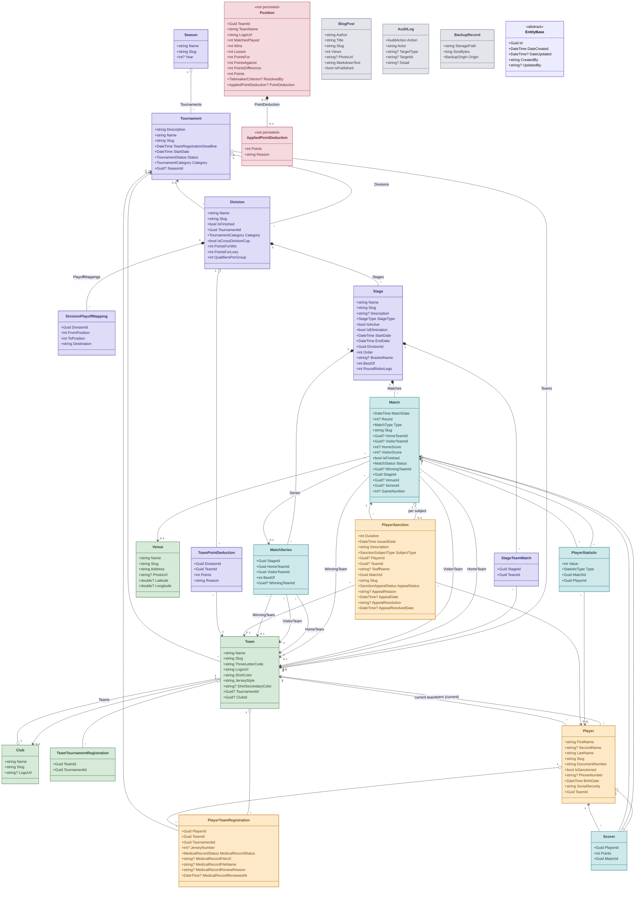

# Modelo de dominio — Backend

Diagrama de clases de las entidades del backend (`Club12-Backend/Domain/Entities/Models/`). 22 clases. Todas heredan de `EntityBase` (Id + audit fields) salvo `Position` y `AppliedPointDeduction`, que son DTOs de solo lectura calculados en memoria, no persistidos. La herencia no se dibuja arco por arco para no saturar el diagrama con 20 líneas repetidas hacia el mismo nodo — `EntityBase` queda suelta, ver su clase al pie.

> Muestra **todos los campos escalares mapeados** de cada entidad. No incluye propiedades `[NotMapped]` (computadas en memoria: `Player.FullName`, `Player.IsHabilitado`, `Player.JerseyNumber`, `PlayerTeamRegistration.IsHabilitado`, etc.) ni navegaciones de colección inversas redundantes con la relación ya dibujada. Regenerar si cambian las entidades; el color de cada clase indica su área funcional.

## Diagrama de clases

## Áreas

| Color | Área | Entidades |
|---|---|---|
| 🟣 | Competencia (torneo/estructura) | Season, Tournament, Division, DivisionPlayoffMapping, Stage, StageTeamMatch, TeamPointDeduction |
| 🟢 | Equipos & canchas | Club, Team, TeamTournamentRegistration, Venue |
| 🟠 | Jugadores | Player, PlayerTeamRegistration, PlayerSanction |
| 🔵 | Partidos | Match, MatchSeries, PlayerStatistic, Scorer |
| 🔴 | Cálculo (no persistido) | Position, AppliedPointDeduction |
| ⚪ | Config / sistema | BlogPost, AuditLog, BackupRecord |

## Invariantes que el diagrama no muestra

- **`Team.TournamentId` es un puntero denormalizado, no la fuente de verdad** — un mismo `Team` se reutiliza entre temporadas repuntando este campo; el historial real de participación vive en `TeamTournamentRegistration` (una fila por temporada, nunca se reescribe). Lo mismo pasa entre `Player.TeamId` (puntero al equipo actual) y `PlayerTeamRegistration` (fuente de verdad del roster por temporada).
- **Ficha médica ("habilitado") es por temporada, no por jugador** — `PlayerTeamRegistration.MedicalRecordStatus` arranca en `Pending` en cada registración nueva; nunca hereda la aprobación de una temporada anterior (HU-59). Un jugador está habilitado solo si el estado es `Approved` **y** hay un archivo real cargado (no un ref legacy) — dos condiciones, no una.
- **`Club` es identidad estable; `Team` es una fila por temporada** — "Colón SF 2026" y "Colón SF 2027" son dos `Team` distintos, opcionalmente enlazados al mismo `Club` vía `Team.ClubId` (FK opcional, aditiva). Sin `Club`, todo sigue funcionando como antes.
- **El bracket de playoffs se arma vía `DivisionPlayoffMapping`, no a mano** — mapea rangos de posición final de la fase de grupos a un destino (`Stage.BracketName`, ej. "Copa Oro"/"Copa Plata"); los rangos no se solapan y una posición fuera de todo rango no clasifica.
- **`MatchSeries.BestOf` se copia del `Stage` al crear la serie** — un cambio posterior en `Stage.BestOf` nunca reescribe retroactivamente una serie en curso o ya decidida.
- **`Match.Round` (jornada) es la clave de agrupación del fixture, no la fecha calendario** — editar la fecha de un partido (HU-68) nunca cambia su ronda; con número impar de equipos, un equipo queda libre cada ronda.
- **`PlayerSanction.SubjectType` decide qué FK es válida** — la sanción apunta a `Player`, `Team` o (sin entidad propia todavía) un `StaffName` de texto libre, exactamente una de las tres según el tipo de sujeto.
- **`Position` y `AppliedPointDeduction` no son tablas** — son objetos calculados en memoria por el servicio de posiciones a partir de `Match` + `TeamPointDeduction`, expuestos solo como DTO de lectura.
- **Slugs son inmutables desde la creación** — casi toda entidad pública (`Team`, `Player`, `Tournament`, `Division`, `Stage`... — no en el diagrama por brevedad salvo donde aparece el campo) genera su `Slug` una sola vez a partir del nombre; renombrar la entidad después nunca rompe un link ya compartido.
