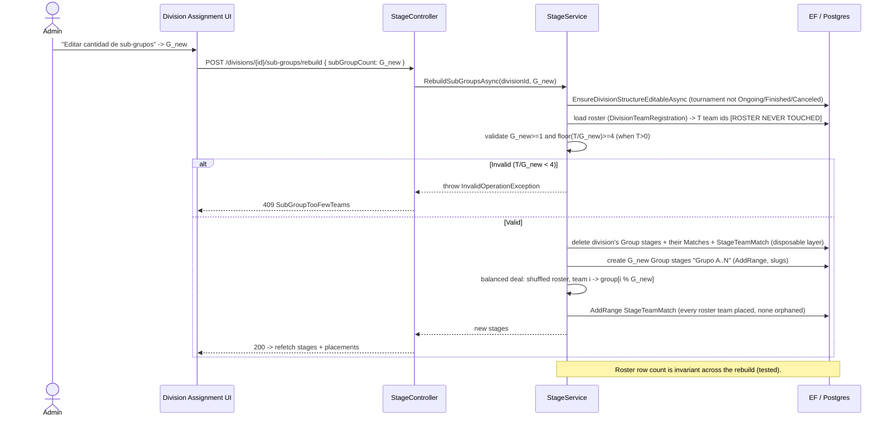

# Design: Division Team Roster & Playoffs-Only Seeding

Status: technical design complete. Input: `proposal.md` (authoritative decisions) + `exploration.md`
(current code facts). This document turns the proposal's prose decisions into concrete entities, EF
configuration, migration SQL, service/interface signatures, guard queries, DTO shapes, and frontend
component changes, respecting Clean Architecture layering (API -> Application -> Domain; Infrastructure
implements Application/Domain contracts).

**Database is PostgreSQL (Npgsql)**, verified from the existing migrations (`uuid`,
`timestamp without time zone`, `text` column types; `"Club12"."Table"` quoting; `regexp_replace`
data-migration SQL). The `EntityConstants.DateTime2`/`Decimal18x4` comments say "SQL Server" but that
is stale text; all backfill SQL in this design is PostgreSQL. Every code sketch conforms to
`DOTNET_STANDARDS.md` (one type per file, PascalCase `const`, nullable enabled, `Async` suffix,
3-line plain-prose `<summary>`, no ticket refs / parentheses / example call-outs in doc comments) and
to the React 19 / TypeScript skills (named imports, no manual memoization, const-object-then-type,
flat interfaces).

---

## 0. Decisions I had to make (proposal did not fully settle)

These are design-level calls the proposal left open or that fell out of reading the code. Each is
load-bearing for `sdd-spec`/`sdd-tasks`.

- **D1 — Dedicated roster service, not roster-on-StageService.** The proposal's Affected-Areas table
  folds roster endpoints into `StageController`/`StageService`. Division-level enrolment is not a
  stage concern, and mixing it into `StageService` (already the largest service) violates SRP. I
  introduce `IDivisionRosterService`/`DivisionRosterService` (Application) + `DivisionRosterController`
  (API) for roster CRUD and the cross-division-conflict rule, and keep only the *stage-structural*
  operations (draw/preview/re-draw guard/sub-group rebuild) on `StageService`. This is a refinement of
  the proposal's file list, not a change to any proposal decision. Rationale: mirrors the
  `TeamTournamentRegistration` sibling (its own concern), keeps the conflict rule at the roster layer
  exactly as the proposal wants, and gives tasks a clean seam.
- **D2 — Relax the "one Group stage per non-cross-cup division" invariant in `CreateStageAsync`.**
  Sub-groups (HU-121) make a *regular* division legitimately hold G>1 Group stages. `CreateStageAsync`
  currently throws `GroupStageAlreadyExistsInDivision` for a 2nd Group stage in a non-cross-cup
  division, and `TournamentService` (the wizard's full-creation path) calls `CreateStageAsync` per
  stage — so wizard sub-group creation would hit that guard on the 2nd sub-group. Decision: remove the
  `hasGroupStage && !isCrossDivisionCup` throw entirely; the duplicate-**name** guard
  (`AlreadyExistsInDivision`) already prevents true accidental duplicates, and sub-group names are
  distinct ("Grupo A", "Grupo B"…). This also satisfies the split-league forward-compat flag. **Bound:**
  a multi-sub-group *regular* division does not get automatic cross-sub-group playoff seeding here —
  that is HU-125, explicitly out of scope; this change only makes the roster + sub-group *structure*
  legal and balanced.
- **D3 — The draw token carries the exact ordered `List<Guid>`, not an RNG seed.** The proposal
  allowed either. A replayed ordered list is a strictly stronger preview==commit guarantee (no
  dependence on a stable shuffle implementation across preview and commit). The token is an opaque,
  base64url-encoded, HMAC-signed payload `{ stageId, orderedTeamIds[], issuedAtUtc, nonce }`. Commit
  verifies the signature and that `orderedTeamIds` is exactly the division roster set, then seeds from
  that order. See §2.4.
- **D4 — The re-draw guard ignores byes and empty slots when testing "played".** A drawn bracket
  already has bye matches with `IsFinished = true` and a `WinningTeamId` set (see
  `FillStageWithSeedsAsync`). If "played" naively included `IsFinished`, a bracket would lock itself
  the instant it is first drawn. Concrete rule: a match counts as *played* only when it is a real
  contest (`HomeTeamId` **and** `VisitorTeamId` both set) **and** (`IsFinished` OR `HomeScore != null`
  OR `VisitorScore != null` OR `Status == MatchStatus.Played`). Byes and still-empty slots never count.
  See §2.5.
- **D5 — Draw commit is idempotent over initial-vs-re-draw via a reset step.** Rather than two code
  paths, commit always (a) checks the guard, (b) resets every match in the bracket's stages to
  unseeded and deletes their `MatchSeries`, (c) fills the first-round stage from the ordered list, (d)
  advances byes, (e) stamps `DrawnAt`, (f) audits. On an initial draw the reset is a no-op. See §2.6.
- **D6 — `Stage.DrawnAt` is stamped on the bracket's first-round (min-depth) stage only**, and the
  public bracket view reads it from that stage. Setting it on every stage of the bracket is redundant.
- **D7 — Unenrol cascades placements explicitly.** Deleting a `DivisionTeamRegistration` does not
  FK-cascade to `StageTeamMatch` (the FK is registration->Team/Division, not ->StageTeamMatch).
  Unenrol therefore first deletes the team's `StageTeamMatch` rows within that division's stages, then
  deletes the registration — preserving the "every placement has a registration" invariant.
- **D8 — `TournamentDivisionAssignment.test.tsx` already exists** (added since the exploration; it
  mocks `generateStagesAutomatically` at line 192). The proposal's "zero existing tests" risk is
  stale. The work is *extending* that suite (and, per D-HU124, removing the now-dead
  `generateStagesAutomatically` mock line), not creating first-time coverage. Flagged in Risks.
- **D9 — Auto-distribute clears then redistributes.** HU-122's one-click auto-distribute over a
  division's existing sub-group stages clears current `StageTeamMatch` placements for those stages and
  re-runs balanced distribution over the full roster, so the result is always balanced. Manual
  per-group adjustment remains the follow-up step. (Fill-only-empties would leave prior imbalance in
  place; rejected.)

---

## 1. `DivisionTeamRegistration` entity (the roster)

### 1.1 Domain entity

New file `Club12-Backend/Domain/Entities/Models/DivisionTeamRegistration.cs`, mirroring
`TeamTournamentRegistration` exactly (one type per file, `required` FKs, nullable navs, inherits the
five `EntityBase` audit fields `Id`/`DateCreated`/`DateUpdated`/`CreatedBy`/`UpdatedBy`). **No
status/lifecycle enum** (proposal §1 — boolean presence means "enrolled").

```csharp
using System;

namespace Domain.Entities.Models;

/// <summary>
/// The authoritative record that a team is enrolled in a division, independent of any stage placement.
/// </summary>
public class DivisionTeamRegistration : EntityBase
{
    public required Guid TeamId { get; set; }
    public Team? Team { get; set; }

    public required Guid DivisionId { get; set; }
    public Division? Division { get; set; }
}
```

**Navigation collections added** (needed for the `WithMany` in config and for cascade):
- `Team.cs`: `public virtual ICollection<DivisionTeamRegistration> DivisionTeamRegistrations { get; set; } = [];`
- `Division.cs`: `public virtual ICollection<DivisionTeamRegistration> DivisionTeamRegistrations { get; set; } = [];`

### 1.2 EF configuration

New file `Infrastructure/Persistance/Configurations/DivisionTeamRegistrationEntityConfiguration.cs`,
mirroring `TeamTournamentRegistrationEntityConfiguration` (extends `BaseEntityConfiguration<T>`, which
already wires the key, `DateCreated` + `IX_{TypeName}_CreatedAt` index, `DateUpdated`).

```csharp
using Domain.Entities.Models;

using Microsoft.EntityFrameworkCore;
using Microsoft.EntityFrameworkCore.Metadata.Builders;

namespace Infrastructure.Persistance.Configurations;

/// <summary>
/// A team is enrolled in the same division at most once, enforced by a unique index on TeamId and DivisionId.
/// </summary>
public class DivisionTeamRegistrationEntityConfiguration : BaseEntityConfiguration<DivisionTeamRegistration>
{
    protected override void ConfigureEntity(EntityTypeBuilder<DivisionTeamRegistration> builder)
    {
        builder.ToTable(EntityConstants.Tables.DivisionTeamRegistration, EntityConstants.Schema);

        builder.Property(r => r.TeamId).IsRequired();
        builder.Property(r => r.DivisionId).IsRequired();

        builder.HasIndex(r => new { r.TeamId, r.DivisionId }).IsUnique();

        builder.HasOne(r => r.Team)
            .WithMany(t => t.DivisionTeamRegistrations)
            .HasForeignKey(r => r.TeamId)
            .OnDelete(DeleteBehavior.Cascade);

        builder.HasOne(r => r.Division)
            .WithMany(d => d.DivisionTeamRegistrations)
            .HasForeignKey(r => r.DivisionId)
            .OnDelete(DeleteBehavior.Cascade);
    }
}
```

The unique compound index `(TeamId, DivisionId)` doubles as the "many"-side lookup on `TeamId`. A
separate single-column index on the `DivisionId` "many" side is added (mirrors the
`TeamTournamentRegistrations_TournamentId` index) so "list this division's roster" is indexed.

### 1.3 Wiring
- `EntityConstants.Tables`: add `public const string DivisionTeamRegistration = "DivisionTeamRegistrations";`
  (alphabetical, between `DivisionPlayoffMapping` and `Match`).
- `ApplicationDBContext.cs`: add
  `public virtual required DbSet<DivisionTeamRegistration> DivisionTeamRegistrations { get; set; }`
  (config is applied via `ApplyConfigurationsFromAssembly`, as the others are — no explicit registration
  line needed if that convention is used; verify in tasks).

### 1.4 Coexistence with `StageTeamMatch` (additive — proposal §2)

`StageTeamMatch` schema is **unchanged**. Its meaning narrows conceptually to "placed into this
specific stage slot." `DivisionTeamRegistration` is the new authoritative "enrolled in this division"
fact. The invariant added is: **a `StageTeamMatch` may exist only for a `(TeamId, Stage.DivisionId)`
that has a `DivisionTeamRegistration`.** Where each check lives after this change:

| Rule | Before | After |
|------|--------|-------|
| Cross-division conflict ("one regular zone + optional cross-cup") | `EnsureNoCrossDivisionConflictAsync` at **stage assign** time, querying `StageTeamMatch` joined to `Stage.Division` | Moves up to **roster enrol** time in `DivisionRosterService`, querying `DivisionTeamRegistration` joined to `Division` (§2.1). |
| Placement requires membership | not enforced (no roster existed) | `AssignTeamsToStageAsync` now rejects a team with no `DivisionTeamRegistration` for `stage.DivisionId` (§2.2). |
| Slot-capacity, edit-lock (`EnsureDivisionStructureEditableAsync`) | in `StageService` | **stays** in `StageService`, unchanged. |

The old `EnsureNoCrossDivisionConflictAsync`/`FindTeamsInAnotherDivisionAsync` in `StageService`
become redundant for the manual path (roster already enforced the conflict), but are **kept for the
`auto` assignment branch** which pulls tournament-registered teams directly; simplest is to leave both
guards in place (roster membership check is additive, the cross-division check is now a belt-and-suspenders
no-op for manually-enrolled teams). Tasks may simplify later; not required for correctness.

### 1.5 Migration + backfill

New migration `Infrastructure/Migrations/{yyyyMMddHHmmss}_AddDivisionTeamRegistrationAndStageDrawnAt.cs`
(+ `.Designer.cs` + regenerated `ApplicationDBContextModelSnapshot.cs`). It does three things in `Up`:

**(a) Create the table** — identical column shape to `AddTeamTournamentRegistrationTable` (`uuid`,
`timestamp without time zone`, `text`; two FKs `onDelete: Cascade`; three indexes:
`IX_DivisionTeamRegistration_CreatedAt`, unique `IX_DivisionTeamRegistrations_TeamId_DivisionId`,
`IX_DivisionTeamRegistrations_DivisionId`). Note the singular type-name in the CreatedAt index name,
matching the sibling migration's `IX_TeamTournamentRegistration_CreatedAt`.

**(b) Backfill** (raw SQL, `RebackfillDivisionStageSlugs` precedent — PostgreSQL). Exactly one row per
distinct `(TeamId, DivisionId)` pair, `DivisionId` resolved via `Stage.DivisionId`, **deduplicated on
the pair, never on `TeamId` alone** (so a cross-cup team in division A and division B yields two rows):

```sql
INSERT INTO "Club12"."DivisionTeamRegistrations"
    ("Id", "TeamId", "DivisionId", "DateCreated", "DateUpdated", "CreatedBy", "UpdatedBy")
SELECT gen_random_uuid(),
       stm."TeamId",
       s."DivisionId",
       now() AT TIME ZONE 'utc',
       NULL,
       'System',
       NULL
FROM "Club12"."StageTeamMatches" stm
JOIN "Club12"."Stages" s ON stm."StageId" = s."Id"
WHERE NOT EXISTS (
    SELECT 1 FROM "Club12"."DivisionTeamRegistrations" dtr
    WHERE dtr."TeamId" = stm."TeamId" AND dtr."DivisionId" = s."DivisionId"
)
GROUP BY stm."TeamId", s."DivisionId";
```

- `GROUP BY (TeamId, DivisionId)` collapses a team in multiple sub-groups of one division, or in a
  group + same-division bracket, to one row.
- Distinct `(TeamId, DivisionId)` pairing preserves the cross-cup team's two rows automatically.
- The `NOT EXISTS` guard makes the backfill **idempotent** (safe to re-run over partial data — supports
  the proposal's forward-redeploy-after-rollback point).
- `CreatedBy = 'System'` matches `AuditConstants.SystemUser`. `gen_random_uuid()` is built-in on the
  PostgreSQL versions this project targets; if a target lacks it, switch to `uuid_generate_v4()` with
  the `uuid-ossp` extension — tasks verify.

**(c) Add `Stage.DrawnAt`** — `migrationBuilder.AddColumn<DateTime>("DrawnAt", schema: "Club12",
table: "Stages", type: "timestamp without time zone", nullable: true)`.

**`Down`** (cleanly reversible, per rollback plan): `DropColumn("DrawnAt", ...)` then
`DropTable("DivisionTeamRegistrations", schema: "Club12")`. The backfill has no inverse and needs none —
dropping the table loses only a projection still fully implied by the surviving `StageTeamMatch`/`Stage`
rows (proposal Rollback Plan). See §6 for the roster-only playoffs-division rollback caveat.

---

## 2. Backend service / API surface

### 2.1 `IDivisionRosterService` (new — roster CRUD + conflict rule) [D1]

New files: `Application/Interfaces/Services/IDivisionRosterService.cs`,
`Application/Services/DivisionRosterService.cs`. Injects `IGenericRepository<DivisionTeamRegistration>`,
`IGenericRepository<StageTeamMatch>`, `IDivisionRepository`.

```csharp
public interface IDivisionRosterService
{
    /// <summary>
    /// Returns every team currently enrolled in the division, independent of any stage placement.
    /// </summary>
    Task<List<Team>> GetRosterAsync(Guid divisionId);

    /// <summary>
    /// Enrols teams in a division, rejecting any already in another regular division of the same tournament.
    /// </summary>
    /// <exception cref="InvalidOperationException">Thrown as a 409 when a team is already in a conflicting regular division, or the tournament has started.</exception>
    Task<List<DivisionTeamRegistration>> EnrollTeamsAsync(Guid divisionId, List<Guid> teamIds);

    /// <summary>
    /// Removes teams from a division's roster and clears any of their stage placements within that division.
    /// </summary>
    Task UnenrollTeamsAsync(Guid divisionId, List<Guid> teamIds);
}
```

- `EnrollTeamsAsync`: guarded by `EnsureDivisionStructureEditableAsync`-equivalent (reuse the tournament
  edit-lock; extract the private guard to a shared helper or duplicate the small check). Skips teams
  already registered (idempotent, mirroring `AssignTeamsToStageAsync`'s `Distinct().Where(not existing)`).
  Cross-division-conflict rule at the **roster** layer:

  ```
  If the target division is NOT IsCrossDivisionCup:
     reject any teamId that already has a DivisionTeamRegistration in a DIFFERENT division of the
     same tournament where that other division is NOT IsCrossDivisionCup.
  A team may hold one regular-division registration PLUS one cross-cup registration.
  ```

  Concrete query (repository `FindAsync` over `DivisionTeamRegistration` with `Division` included):
  `dtr.TeamId in teamIds && dtr.DivisionId != divisionId && dtr.Division.TournamentId == target.TournamentId && !dtr.Division.IsCrossDivisionCup`.
  A non-empty result throws `InvalidOperationException(ErrorMessages.Division.ConflictingRosterEnrollment(...))`
  (new message, mirrors `ConflictingTeamAssignment` style).
- `UnenrollTeamsAsync` [D7]: guarded the same way; first
  `_stageTeamMatchRepository.RemoveAsync(stm => teamIds.Contains(stm.TeamId) && stm.Stage!.DivisionId == divisionId)`,
  then `_registrationRepository.RemoveAsync(dtr => dtr.DivisionId == divisionId && teamIds.Contains(dtr.TeamId))`.

### 2.2 `AssignTeamsToStageAsync` — roster-aware (StageService, modified)

Add, right after the edit-lock guard and before slot math, a **membership precondition** for the
manual (`!auto`) path:

```
filteredIds = teamIds.Distinct().Where(not already on this stage)
registered = registrations where DivisionId == stage.DivisionId and TeamId in filteredIds
if any filteredId has no registration -> throw InvalidOperationException(
    ErrorMessages.Stage.TeamNotEnrolledInDivision(missingIds))   // new message, mapped 409/400
```

The existing cross-division-conflict call stays (now redundant for enrolled teams, harmless). The
`auto` branch is unchanged except that its candidate pool SHOULD be the division roster rather than
all tournament-registered teams — change its `_teamRepository.FindAsync(team.TournamentId == …)` to
pull teams that have a `DivisionTeamRegistration` for `stage.DivisionId` and are not yet on the stage.
This makes auto-fill roster-scoped (correct for sub-groups). Flag: this is a behavior change to `auto`;
covered by extending `StageServiceTests`/`UnassignedTeamsTests`.

### 2.3 `DivisionRosterController` (new — API)

New file `API/Controllers/DivisionRosterController.cs`, `[Authorize(Roles = Roles.AdminOrOwner)]` for
writes, reads may be `[AllowAnonymous]` if the assignment UI is admin-only (keep authorized — this is
an admin workspace). Routes under the division:

| Verb + route | Body | Calls | Notes |
|---|---|---|---|
| `GET  /api/divisions/{divisionId}/roster` | — | `GetRosterAsync` | returns `List<TeamResponse>` |
| `POST /api/divisions/{divisionId}/roster` | `EnrollTeamsRequest { List<Guid> TeamIds }` | `EnrollTeamsAsync` | 200 / 409 on conflict |
| `DELETE /api/divisions/{divisionId}/roster` | `UnenrollTeamsRequest { List<Guid> TeamIds }` | `UnenrollTeamsAsync` | 200 |

New request DTOs (one type per file) under `Application/DTOs/Division/Request/`. Response reuses the
existing team response DTO/mapper.

### 2.4 Playoffs-only draw — preview + commit (StageService, new)

Add to `IStageService`/`StageService`:

```csharp
/// <summary>
/// Computes a first-round pairing for a groupless bracket without persisting it, returning a signed token that replays the exact same order on commit.
/// </summary>
Task<DrawPreviewResult> PreviewDrawAsync(Guid stageId, DrawMode mode, List<Guid>? manualOrder = null);

/// <summary>
/// Seeds a groupless bracket from a previewed token or a manual order, stamping DrawnAt and auditing the draw.
/// </summary>
Task<List<Match>> CommitDrawAsync(Guid stageId, DrawMode mode, string? drawToken = null, List<Guid>? manualOrder = null);
```

- `DrawMode` (new `Domain.Enums` enum, one type per file): `Random`, `Manual`.
- `PreviewDrawAsync`:
  1. Load the target first-round `Stage` (+ `Division`, `Matches`). Reject if the division HAS a group
     phase (that path uses `SeedKnockoutStageAsync`); this endpoint is for groupless brackets only —
     `stage.Division` has no `StageType.Group` stage.
  2. Roster = `DivisionRosterService.GetRosterAsync(stage.DivisionId)` team ids. Reject `< 2`.
  3. `orderedTeamIds` = `mode == Random ? Shuffle(roster) : manualOrder` (validate `manualOrder` is a
     permutation of the roster set). Shuffle uses `Random.Shared` server-side.
  4. `pairs = PlayoffSeeder.SeedPairs(orderedTeamIds)` (reused unchanged — pads to power of two with
     `null` byes, classic 1-vs-N order).
  5. Return `DrawPreviewResult { List<DrawPairPreview> Pairs; string DrawToken }` where `DrawToken`
     [D3] = base64url(HMAC-signed JSON `{ stageId, orderedTeamIds, issuedAtUtc, nonce }`). Nothing is
     written.
- `CommitDrawAsync` — see §2.6. For `Random`, `drawToken` is required and replayed; for `Manual`,
  `manualOrder` is used directly (and equally could be tokenized, but manual needs no preview
  guarantee). The token's HMAC key comes from configuration (reuse the app's existing signing/secret
  config; tasks confirm the key source). Token validity is checked by signature + stage-id match +
  roster-set match; an expired/mismatched token throws `InvalidOperationException` -> 409.

New DTOs (`Application/DTOs/Stage/Request` and `.../Response`, one per file):
`DrawRequest { DrawMode Mode; string? DrawToken; List<Guid>? ManualOrder }`,
`DrawPreviewResult`, `DrawPairPreview { Guid HomeTeamId; Guid? VisitorTeamId }`.

### 2.5 Re-draw guard (StageService, new private) [D4]

```csharp
/// <summary>
/// Blocks a bracket (re-)draw once any real match in that division and bracket name has been played.
/// </summary>
private async Task EnsureBracketDrawableAsync(Stage firstRoundStage)
{
    bool anyPlayed = await _matchRepository.ExistsAsync(m =>
        m.Stage.DivisionId == firstRoundStage.DivisionId
        && m.Stage.BracketName == firstRoundStage.BracketName
        && m.HomeTeamId.HasValue && m.VisitorTeamId.HasValue
        && (m.IsFinished || m.HomeScore.HasValue || m.VisitorScore.HasValue
            || m.Status == MatchStatus.Played));

    if (anyPlayed)
    {
        throw new InvalidOperationException(ErrorMessages.Stage.BracketAlreadyPlayed);
    }
}
```

- Scoped to `(DivisionId, BracketName)` so parallel brackets ("Copa de Oro" / "Copa de Plata") lock
  **independently**. `BracketName == firstRoundStage.BracketName` correctly compares `null` to `null`
  for the default bracket (EF translates to `IS NOT DISTINCT FROM`; if the provider mistranslates a
  `null` equality, tasks use an explicit null-safe comparison).
- Byes (`VisitorTeamId == null`) and empty slots are excluded by the `HomeTeamId && VisitorTeamId`
  predicate, so a freshly drawn bracket is still re-drawable [D4].
- Evaluated **independently of tournament status** — a legitimate playoff draw happens after the
  tournament is `Ongoing`. New message `ErrorMessages.Stage.BracketAlreadyPlayed` -> mapped to 409 by
  `GlobalExceptionHandler`, consistent with existing guard style.

### 2.6 Commit flow internals [D5]

`CommitDrawAsync`:
1. Load first-round stage (+ Division, Matches). Resolve all bracket stages:
   `bracketStages = stages where DivisionId == s.DivisionId && BracketName == s.BracketName`.
2. `await EnsureBracketDrawableAsync(firstRoundStage);`
3. **Reset** every match in `bracketStages`: null out `HomeTeamId`/`VisitorTeamId`/`WinningTeamId`,
   `HomeScore`/`VisitorScore`, set `IsFinished = false`, `Status = Scheduled`, `SeriesId = null`,
   `GameNumber = null`; delete their `MatchSeries` rows. (No-op on an initial draw.)
4. Resolve `orderedTeamIds` (token for `Random`, `manualOrder` for `Manual`; validate against roster).
5. `orderedMatches = await FillStageWithSeedsAsync(firstRoundStage, orderedTeamIds);` (reused — sets
   pairs, marks byes `IsFinished` + winner, creates series for `BestOf > 1`).
6. `await _matchRepository.UpdateRangeAsync(orderedMatches);`
7. `firstRoundStage.DrawnAt = DateTime.UtcNow; await _stageRepository.UpdateAsync(firstRoundStage);` [D6]
8. `await TryAdvanceStageWinnerAsync(firstRoundStage.Id);` (walks byes into the next round — reused).
9. **Audit** (fire-and-forget, never blocks): `await _auditService.LogAsync(AuditAction.PlayoffDraw,
   targetType: "Stage", targetId: firstRoundStage.Id.ToString(), targetName: firstRoundStage.Name,
   detail: mode == Random ? $"Sorteo aleatorio — {orderedTeamIds.Count} equipos" : $"Sorteo manual — {orderedTeamIds.Count} equipos");`
   `AuditService.LogAsync` already swallows/logs its own failures, so this cannot break the draw.
10. Return `orderedMatches`.

### 2.7 Sub-group rebuild (HU-123) + balanced distribution (HU-121/122)

Add to `IStageService`/`StageService`:

```csharp
/// <summary>
/// Rebuilds a regular division's sub-group stage layer to a new count and re-balances the untouched roster across it.
/// </summary>
Task<List<Stage>> RebuildSubGroupsAsync(Guid divisionId, int subGroupCount);

/// <summary>
/// Balances the division's whole roster across its existing sub-group stages, replacing current placements.
/// </summary>
Task AutoDistributeRosterAsync(Guid divisionId);
```

- `RebuildSubGroupsAsync` (HU-123):
  1. `EnsureDivisionStructureEditableAsync(divisionId)` (tournament not Ongoing/Finished/Canceled).
  2. Load roster team ids `T` from `DivisionTeamRegistration`. **Roster is never mutated.**
  3. Validate `subGroupCount G >= 1` and `floor(T/G) >= 4` when `T > 0` (min 4 per sub-group — reject
     otherwise with a new `ErrorMessages.Stage.SubGroupTooFewTeams`). At rebuild time `T` may be 0
     (structure before enrolment) — then skip the min-4 check and just create empty sub-groups.
  4. **Delete the disposable layer only:** existing `Group` stages of the division and their
     `Matches` + `StageTeamMatch` rows (cascade via `Stage` FK delete). Non-group (bracket) stages are
     left intact.
  5. Create `G` new `Group` stages via `_stageRepository.AddRangeAsync` (bypasses `CreateStageAsync`'s
     single-stage guard by design; also unaffected by D2). Names: `"Grupo A" … "Grupo {char}"` — the
     **"sub-group / pool"** vocabulary, never "zona". `Order` 0..G-1. Slugs via `AssignStageSlugsAsync`.
  6. Balanced distribution over the unchanged roster (see algorithm below): create `StageTeamMatch`
     rows. No team orphaned (roster untouched; every roster team placed).
  7. Matches are generated later at tournament start (existing fixture path), so rebuild does not
     create matches — matching the proposal's "rebuild only Stage + StageTeamMatch."
- `AutoDistributeRosterAsync` (HU-122) [D9]: `EnsureDivisionStructureEditableAsync`; load the division's
  existing `Group` stages and roster; delete existing `StageTeamMatch` rows for those stages; run the
  balanced distribution; add new `StageTeamMatch` rows.

**Balanced distribution algorithm** (pure helper, unit-testable, `Application/Utils/Helper/…`):

```
Input: rosterTeamIds (List<Guid>), groupStages (ordered List<Stage>)  // G = groupStages.Count
shuffled = rosterTeamIds.OrderBy(_ => Random.Shared.Next())
for i in 0 .. shuffled.Count - 1:
    targetGroup = groupStages[i % G]     // round-robin deal => each group gets floor(T/G) or ceil(T/G)
    emit StageTeamMatch { StageId = targetGroup.Id, TeamId = shuffled[i], CreatedBy = System, DateCreated = now }
```

Round-robin modulo guarantees max-min group size difference `< 2` (proposal's "never a gap >= 2").
Randomised deal satisfies HU-122's random-balanced default.

New controller endpoints on `StageController` (or a small `DivisionStructureController`; keeping them on
`StageController` under the division id is acceptable since they are stage-structural):

| Verb + route | Body | Calls |
|---|---|---|
| `POST /api/stages/{id}/preview-draw` | `DrawRequest` | `PreviewDrawAsync` |
| `POST /api/stages/{id}/draw` | `DrawRequest` | `CommitDrawAsync` |
| `POST /api/divisions/{divisionId}/sub-groups/rebuild` | `RebuildSubGroupsRequest { int SubGroupCount }` | `RebuildSubGroupsAsync` |
| `POST /api/divisions/{divisionId}/roster/auto-distribute` | — | `AutoDistributeRosterAsync` |

(If the sub-group/auto-distribute routes are placed on `StageController` they still key on
`divisionId`; if a `DivisionRosterController`/`DivisionStructureController` is preferred, keep them
next to the roster routes. Tasks pick one; both are consistent with existing route style.)

### 2.8 Completability validator extension (HU-121 blocking check)

`TournamentCompletabilityValidator.Validate` currently reads assigned teams from `StageTeamMatch` via
`GroupStageTeamIds`. Extend it with a sub-group-balance rule per regular division:

- New constant `MinTeamsPerSubGroup = 4`.
- New issue code `SubGroupTooFewTeams` in `CompletabilityIssueCodes` (+ Spanish label on the frontend
  `completabilityMessages`). Fires when a regular division has `G > 1` group stages and any sub-group
  has `< MinTeamsPerSubGroup` assigned, or the split is unbalanced (max-min `>= 2`). Because the
  balanced rebuild guarantees balance, this mainly catches a hand-edited imbalance.
- The validator signature stays the same (it already receives the tournament graph with stages +
  `StageTeamMatches`); it does not need the roster directly for this rule since placement is what must
  be balanced at start. (If a "roster team never placed into any sub-group" check is wanted, that is
  the existing `TeamNotAssigned` rule — no change needed.)

### 2.9 `AuditAction.PlayoffDraw` (three-file change)

- `Domain/Enums/AuditAction.cs`: add `PlayoffDraw` member with a 3-line plain-prose summary
  ("A bracket seeding draw, initial or re-draw, recorded for transparency.").
- Frontend `modules/auditLog/type/auditLog.d.ts`: add `'PlayoffDraw'` to the `AuditAction` union.
- Frontend `views/panel/AuditLogsPage.tsx` `ACTION_LABELS`: add `PlayoffDraw: 'Sorteo de llave'`.

### 2.10 `Stage.DrawnAt` surfacing

- `Domain/Entities/Models/Stage.cs`: add `public DateTime? DrawnAt { get; set; }` with a 3-line
  summary ("When this bracket's seeding draw was committed, null until a draw runs.").
- `Application/DTOs/Stage/Response/StageResponse.cs`: add `public DateTime? DrawnAt { get; set; }`.
  AutoMapper maps by member-name convention (verify the `Stage`->`StageResponse` profile has no
  member-exclusion; add an explicit `.ForMember` only if needed).
- No EF config needed beyond the migration column (nullable scalar, mapped by convention).

---

## 3. HU-124 removal (dead endpoint) [D-HU124]

Delete, having re-verified callers via impact analysis (proposal mandates this before deletion; the
codegraph blast-radius already shows `CreateAutomatedStagesAsync` is called only by the controller):

**Backend:**
- `StageService.CreateAutomatedStagesAsync` (and its private-only helper `IsValidTournamentSize` if it
  becomes unused after removal — verify; `BuildStage`/`AssignStageSlugsAsync` are shared, keep them).
- `IStageService.CreateAutomatedStagesAsync` interface member.
- `StageController.GenerateStagesAndMatches` (route `POST /api/stages/generate/{id}`).
- If `TournamentBracketSize` / `MaxTeams.Group` become unreferenced after removal, leave them (other
  constants in the class are still used; `MaxTeams.Group` is referenced by `AssignTeamsToStageAsync`'s
  comment only — confirm no live use before deleting the constant).

**Frontend (the `generateStages` caller chain):**
- `modules/stage/service/stage.service.ts`: delete `generateStages`.
- `modules/stage/context/stage.context.tsx`: delete `generateStagesMutation` (line ~59-60),
  `generateStagesAutomatically` (line ~195-210), and both context-value entries (lines ~267, ~280).
- `modules/stage/type/stage.ts`: delete `generateStagesAutomatically` from `IStageContextProps` (line ~61).
- `views/tournament/TournamentDivisionAssignment.test.tsx`: delete the now-dangling
  `generateStagesAutomatically: vi.fn()` mock entry (line ~192) [D8].

Cross-check: the exploration found zero UI callers; the only references are the definition chain above.
The deletion task re-runs impact analysis to confirm no other backend caller.

---

## 4. Frontend design

### 4.1 `TournamentDivisionAssignment.tsx` — fix the dead-fallback bug (roster-driven)

Root cause (exploration §1): the component derives each division's assignable groups from
`getStagesByFilters({ stageType: Group })`, so a playoffs-only division returns `[]` and renders no
"add team" widget; the `groupStages.length > 0 ? groupStages : items` fallback is dead code.

**Fix:** the "who is enrolled in this division" question now comes from the **roster endpoint**, not
from stage rows. Rework the `useEffect` load per division:
- Fetch the division roster: `GET /api/divisions/{divisionId}/roster` (new `divisionService.getRoster`
  / `useDivision().getRoster`).
- Fetch the division's group stages (sub-groups) as today, for placement targets.
- Render **two layers**:
  1. **Division roster panel** — enrol/unenrol teams into the division (the widget that a
     playoffs-only division was missing). Reuse `TeamPickerDialog` for "enrol"; a chip/list with a
     remove action for unenrol. This always renders, even with zero group stages.
  2. **Sub-group placement** (only when the division has group stages) — the existing per-group picker,
     but its eligible pool is now the **division roster minus already-placed**, plus an
     **"Auto-repartir"** button calling `POST /api/divisions/{id}/roster/auto-distribute`.
- For a **groupless (playoffs-only) division**, layer 2 is replaced by the **draw UI** (§4.2): the
  roster panel enrols teams, then a "Sortear llave" action seeds the bracket.
- `eligibleTeamsFor` changes from "enrolled tournament teams minus other-zone teams" to "division
  roster minus teams already placed in this sub-group." The cross-zone exclusion is no longer computed
  client-side (the roster enrol endpoint enforces it server-side and returns 409).

Testability [D8]: extend the existing `TournamentDivisionAssignment.test.tsx`. Add
`getRoster`/`enrollTeams`/`unenrollTeams`/`autoDistribute` to the mocked `useDivision`/`useStage`
hooks; cover the playoffs-only division now rendering an enrol widget (the bug's regression test).

### 4.2 Playoffs-only seeding UI (draw dialog + manual + public label)

- **Random draw with preview** (admin bracket/division page):
  - "Sortear llave (aleatorio)" -> `POST /api/stages/{firstRoundStageId}/preview-draw` with
    `{ mode: 'Random' }` -> renders the previewed pairing in a dialog **plus the returned `drawToken`
    held in component state**.
  - "Volver a sortear" re-calls preview (new token). "Confirmar sorteo" -> `POST /.../draw` with
    `{ mode: 'Random', drawToken }`. Because the token replays the exact order, the confirmed bracket
    equals the previewed one [D3].
- **Manual seeding**: a slot-assignment UI (ordered list / drag or numbered selects mapping team ->
  seed position) -> `POST /.../draw` with `{ mode: 'Manual', manualOrder: [teamId…] }`. Reuse the
  bracket seed-order preview via `preview-draw` `{ mode:'Manual', manualOrder }` for a confirm step if
  desired.
- **Bye display**: no new work — `PlayoffBracket.tsx` + `bracketAdapter`/`matchStatus.isBracketBye`
  already render byes from the seeded matches (`VisitorTeamId == null`, `IsFinished`).
- **"Sorteo realizado el [fecha]"** on the public bracket view: `IStageResponse` gains
  `drawnAt?: string | null` (mirrors `StageResponse.DrawnAt`). `PlayoffBracket.tsx` (or its public
  wrapper) renders, when the first-round stage's `drawnAt` is set, a caption
  `Sorteo realizado el {formatDate(drawnAt)}` above the bracket. This is public-safe (the field rides
  the already-public `IStageResponse`, not the admin-only audit trail).

New frontend service/type surface:
- `modules/stage/service/stage.service.ts`: `previewDraw(id, body)`, `commitDraw(id, body)`.
- `modules/stage/type/stage.ts`: `IStageResponse.drawnAt?: string | null`; new `DrawMode` const-object
  + type (`{ Random: 'Random', Manual: 'Manual' } as const`), `IDrawRequest`, `IDrawPreviewResult`,
  `IDrawPairPreview` (flat interfaces).
- `modules/division/service|type`: `getRoster`, `enrollTeams`, `unenrollTeams`, `autoDistribute`,
  `rebuildSubGroups`.

### 4.3 Wizard changes (HU-121 sub-group count)

- `wizard/types.ts` `ZoneConfig`: add `subGroupCount: number` (default `1` in `createEmptyZone`). When
  `1`, behaviour is identical to today (a single Group stage). The cross-cup precedent
  (`CrossCupConfig.groupCount` -> N "Grupo n" stages) is the exact pattern to mirror for a regular zone.
- `ZoneEditor.tsx` / `DivisionesStep.tsx`: add a numeric "Cantidad de sub-grupos" input (min 1), shown
  only when `hasGroupStage` is checked. Non-blocking helper text (no static subtitle per the project
  convention — use the `(i)` `FieldInfoTooltip`) explaining balance; a soft warning if
  `subGroupCount < 1`.
- `wizardLogic.ts`: `validateZonesStep` adds a non-blocking check (subGroupCount >= 1). No real team
  counts exist at wizard time, so the min-4-per-group rule is deferred to the completability guard
  (§2.8) — the wizard warning is advisory only, per proposal §4 HU-121.
- `submitWizard.ts` `buildZoneDivision`: when `subGroupCount > 1`, emit `G` Group-type
  `ICreateFullStageRequest`s named "Grupo A".."Grupo G" (instead of a single Group stage). Verify the
  full-division creation request/`TournamentService` path accepts multiple group stages — D2 removes
  the blocking invariant that would otherwise reject the 2nd.
- `wizardLogic.buildGroupAndCupNodes` (review tree): list the N sub-groups under "Fase de grupos".

### 4.4 HU-123 edit-after-the-fact UI

On the division detail / assignment page, an "Editar cantidad de sub-grupos" control (visible while the
tournament is not Ongoing/Finished/Canceled) -> `POST /api/divisions/{id}/sub-groups/rebuild`
`{ subGroupCount }`, with a confirm dialog warning that placements will be re-balanced (roster
preserved). After success, refetch the division's stages + placements. A balanced-distribution preview
(client-side derived from roster count + new G, showing floor/ceil sizes) can be shown before confirm;
the authoritative distribution is the server's.

---

## 5. Sequence diagrams (the two most complex flows)

### 5.1 Random draw: preview -> commit (server-side token guarantees preview == commit)

```mermaid
sequenceDiagram
    actor Admin
    participant UI as Bracket UI
    participant SC as StageController
    participant SS as StageService
    participant RS as DivisionRosterService
    participant PS as PlayoffSeeder
    participant AS as AuditService
    participant DB as EF / Postgres

    Admin->>UI: Click "Sortear llave (aleatorio)"
    UI->>SC: POST /stages/{id}/preview-draw { mode: Random }
    SC->>SS: PreviewDrawAsync(id, Random)
    SS->>DB: load Stage (+Division, Matches); assert no Group phase
    SS->>RS: GetRosterAsync(divisionId)
    RS->>DB: select DivisionTeamRegistration by division
    RS-->>SS: rosterTeamIds
    SS->>SS: orderedTeamIds = Shuffle(roster)
    SS->>PS: SeedPairs(orderedTeamIds)
    PS-->>SS: pairs (byes as null visitor)
    SS->>SS: token = sign({stageId, orderedTeamIds, nonce})
    SS-->>SC: DrawPreviewResult { pairs, drawToken }
    SC-->>UI: 200 { pairs, drawToken }
    UI-->>Admin: Show previewed bracket (+ "Volver a sortear" / "Confirmar")

    alt Admin re-draws
        Admin->>UI: "Volver a sortear"
        UI->>SC: POST preview-draw (new token)
    end

    Admin->>UI: "Confirmar sorteo"
    UI->>SC: POST /stages/{id}/draw { mode: Random, drawToken }
    SC->>SS: CommitDrawAsync(id, Random, drawToken)
    SS->>SS: verify token signature + stageId + roster set
    SS->>DB: EnsureBracketDrawableAsync (no played real match in division+bracketName)
    alt A real bracket match already played
        SS-->>SC: throw InvalidOperationException
        SC-->>UI: 409 BracketAlreadyPlayed
    else Drawable
        SS->>DB: reset all bracket matches + delete MatchSeries (no-op on first draw)
        SS->>PS: SeedPairs(orderedTeamIds from token)
        SS->>DB: FillStageWithSeedsAsync -> set pairs, byes IsFinished, series if BestOf>1
        SS->>DB: Stage.DrawnAt = utcnow (first-round stage)
        SS->>SS: TryAdvanceStageWinnerAsync (walk byes forward)
        SS-)AS: LogAsync(PlayoffDraw, target=Stage, detail) [fire-and-forget]
        SS-->>SC: seeded matches
        SC-->>UI: 200 seeded matches (== preview)
    end
```

### 5.2 Change sub-group count after teams are placed (HU-123, roster preserved)



---

## 6. Migration / rollback concreteness

- **Forward migration** does exactly §1.5 (a)+(b)+(c): create `DivisionTeamRegistrations`, idempotent
  distinct-pair backfill, add nullable `Stage.DrawnAt`.
- **`Down()` is cleanly reversible** structurally: drop `DrawnAt`, drop the table. The backfill has no
  inverse and needs none — every backfilled row is still fully implied by the surviving
  `StageTeamMatch` + `Stage` rows.
- **Roster rows created between deploy and a hypothetical rollback:**
  - A team enrolled via the new roster path in a division that **has** stages also has (or gets) a
    `StageTeamMatch` placement; on rollback to pre-change code the system keeps operating on
    `StageTeamMatch` exactly as before. No data loss beyond the dropped projection.
  - The **one genuine, accepted loss**: a **playoffs-only division** team enrolled purely via the
    roster and **not yet drawn into a bracket slot** exists only as a `DivisionTeamRegistration` (no
    `StageTeamMatch` yet). Rollback drops that row, losing the "enrolled, not yet placed" state for
    that team. Teams already drawn survive (their bracket slot is a `StageTeamMatch`). This is the
    expected rollback cost called out in the proposal — surfaced, not silent.
- **Code rollback is a plain revert:** removing the new endpoints/guard/draw path restores today's
  behaviour (including the original playoffs-only bug). Reverting the HU-124 deletion restores the dead,
  caller-less endpoint (harmless).
- **Forward re-deploy after rollback:** the `NOT EXISTS`-guarded backfill re-runs idempotently — it
  re-inserts only missing distinct pairs, never duplicating existing rows.

---

## 7. Layering & standards conformance summary

- **Domain**: `DivisionTeamRegistration` entity, `Stage.DrawnAt`, `AuditAction.PlayoffDraw`, `DrawMode`
  enum — no dependencies outward.
- **Application**: `IDivisionRosterService`/`DivisionRosterService`, new `StageService` methods, DTOs,
  `TournamentCompletabilityValidator` + `CompletabilityIssueCodes` extension, balanced-distribution
  helper. Depends on Domain + repository interfaces only.
- **Infrastructure**: EF configuration, migration, `EntityConstants`/`ApplicationDBContext` wiring —
  implements the Application/Domain contracts, depended on by nothing above it.
- **API**: `DivisionRosterController`, new `StageController` endpoints, request/response DTO mapping.
- Every C# sketch: one type per file, `Async` suffix, nullable-correct, 3-line plain-prose `<summary>`
  with no ticket refs / parentheses / example call-outs, PascalCase constants, no sync-over-async, no
  swallowed exceptions (audit's fire-and-forget is the audited, intentional exception per ERROR-001).
- Frontend: React 19 (named imports, no `useMemo`/`useCallback` churn beyond what the compiler needs,
  `ref` as prop), TypeScript strict (const-object-then-type for `DrawMode`, flat interfaces, no `any`),
  Vitest + Testing Library, `(i)` `FieldInfoTooltip` instead of static field subtitles.

---

## 8. Open follow-ups handed to `sdd-spec` / `sdd-tasks`

- **HU-125 boundary** (out of scope, must be fenced by `sdd-spec`): a multi-sub-group *regular*
  division with configured playoff cups is where HU-112's single-standings-per-division assumption
  breaks. This change ships the roster + sub-group structure but **not** cross-sub-group playoff
  qualification. `sdd-spec` must state that a regular division with `G > 1` sub-groups + playoff
  mappings is not fully seedable by this change.
- **AutoMapper profile** for `Stage`->`StageResponse`: confirm `DrawnAt` maps by convention (no
  member-exclusion); add `.ForMember` only if the profile is explicit-members.
- **HMAC key source** for the draw token: confirm which existing configuration secret to reuse.
- **`ApplyConfigurationsFromAssembly`** vs explicit `builder.ApplyConfiguration`: confirm the DbContext
  auto-discovers the new configuration (the sibling configs suggest it does).
- **`MaxTeams.Group` / `TournamentBracketSize` / `IsValidTournamentSize`** liveness after HU-124
  deletion: delete only if truly unreferenced (impact analysis in the deletion task).
```
